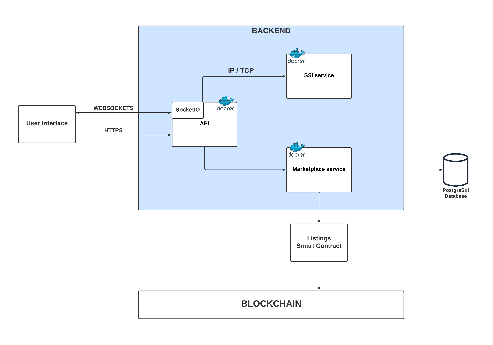

## Functional requirements

#### 1. User login/registration
- Create a DID: The first step is to create a DID for each user.
- Generate Verifiable Credentials: Once the user has a DID, they can generate a set of Verifiable Credentials that contain their personal information, such as name, email, address, or age.
- Login to the Marketplace: When the user wants to log in to the marketplace, they can present a Verifiable Credential that contains their identity information.

#### 2. Product listing
- Sellers should be able to create product listings, which should include product description, price, and availability.
- The listings are stored on the blockchain, ensuring that they cannot be tampered with or removed.
- Once the seller submits the listing, the whole process should be controlled by smart contracts.
- The listing should be stored on blockchain and could not be changed.

#### 3. Marketplace creation
- Users can create a marketplace for a specific event, such as a pop-up market, garage sale, or flea market, by registering the marketplace on the blockchain using their DID.

#### 4. Searching marketplaces
- Logged-in users should be able to see all of the marketplaces in the area
- It should use geofencing mechanism to display near marketplaces

#### 5. Viewing marketplace
-  User can select a specific marketplace
-  The application should display all the items that are listed in a particular marketplace

#### 6. Buying an item
- Users should be able to buy any item in the marketplace only if he/she has enough funds
- The transaction mechanism should involve smart contract that integrates DID registry and VC management system
- The app should connect user to a wallet (MetaMask)

## Non-functional requirements
#### Product requirements
- Use of smart contracts
- Use of DID and VC
- Application should be responsible
- Application should be simple to use

#### Organisational requirements
- The development team should use version control system
- Docker should be included in the application development

## Architecture

## Key technologies
- Ganache: personal ethereum blockchain to easily deploy and monitor smart contracts.
- IPFS: used to store user's data.
- Veramo: SSI framework.
- Solidity: for developing smart contracts.
- Mapbox: for geofencing, extracting coordinates.
- Web3.js: to connect our frontend application with the blockchain.
- ReactJS: to develop our frontend.
- Docker: containerize the application.

## Database schema
We will be storing some of the additional data about our users, listings and marketplaces off-chain. This approach can help to reduce the amount of data that needs to be stored on the blockchain and can lower the gas costs associated with storing and querying the data.

#### User
- DID: integer
- Username: string
- Surname: string
- Age: integer
- E-mail: string

#### Marketplace
- DID: integer
- Name: string
- Description: string
- Lattitude: float
- Longitude: float
- Address: string

#### Listing
- DID: integer- Name: string

- marketplace: Marketplace
- Name: string
- Description: string
- Image: file
- Price: float
- Seller: User
- Specification: string
- Buyer: Optional(User)
